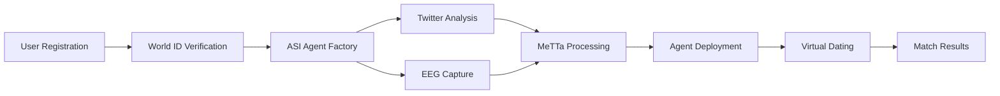

# ASI Integration Layer for MOFO

## Overview

The ASI (Artificial Super Intelligence) package provides advanced AI capabilities for the MOFO dating platform through **zero-touch integration**. It enhances MOFO with autonomous agents, personality analysis, and virtual dating orchestration without modifying the existing codebase.

## Key Features

- 🤖 **Autonomous Agent Creation** - Deploys personalized uAgents on Fetch.ai Agentverse
- 🧠 **EEG Personality Extraction** - Neuroscience-based personality mapping from brain waves
- 🐦 **Twitter Personality Analysis** - Social personality extraction via Twitter API v2
- 🔮 **MeTTa Symbolic Reasoning** - Advanced AI reasoning for personality integration
- 💬 **Virtual Dating Orchestration** - Autonomous agent-to-agent conversations
- 🎯 **ASI LLM Integration** - Natural language generation for authentic interactions
- 🔄 **Zero-Touch Integration** - Works with existing MOFO code without modifications

## Architecture

```
MOFO Frontend (3002) → ASI Proxy (4000) → MOFO Backend
                     ↓
                ASI Services
                     ↓
         Fetch.ai Agentverse Network
```

## Project Structure

```
packages/asi/
├── src/
│   ├── core/
│   │   └── ASIService.ts           # Main orchestrator
│   ├── services/
│   │   ├── AgentFactory.ts         # Creates agents on Agentverse
│   │   ├── AgentManager.ts         # Manages agent lifecycle
│   │   ├── EEGEnhancer.ts          # Enhances EEG data analysis
│   │   ├── MatchmakingService.ts   # Decentralized matching
│   │   ├── MeTTaEngine.ts          # Symbolic AI reasoning
│   │   ├── PersonalityBuilder.ts   # EEG to personality mapping
│   │   ├── ProxyService.ts         # HTTP proxy for API interception
│   │   ├── QueueManager.ts         # Async job processing
│   │   ├── TwitterService.ts       # Twitter personality extraction
│   │   ├── VirtualDatingOrchestrator.ts # Manages virtual dates
│   │   └── WebSocketBridge.ts      # WebSocket connections
│   ├── twitter/
│   │   ├── index.ts                # MCP server implementation
│   │   ├── twitter-api.ts          # Twitter API v2 client
│   │   ├── types.ts                # TypeScript definitions
│   │   ├── formatter.ts            # Response formatting
│   │   └── evals.ts                # Testing framework
│   ├── agents/
│   │   └── python-agent-template.py # Python agent for Agentverse
│   ├── config/
│   │   └── index.ts                # Configuration loader
│   └── utils/
│       └── logger.ts               # Logging utility
├── .env.example                    # Environment template
├── .env.local                      # Your private config (create this)
├── .gitignore                      # Git ignore rules
├── package.json                    # Dependencies
├── tsconfig.json                   # TypeScript config
├── docker-compose.yml              # Docker services
├── start.sh                        # Startup script
└── README.md                       # This file
```

## Quick Start

### Prerequisites

- Node.js >= 18.0.0
- pnpm >= 8.0.0
- Redis (required for queue management)
- Twitter API credentials (optional)
- Fetch.ai Agentverse account (required)

### 1. Install Redis

```bash
# macOS
brew install redis
brew services start redis

# Docker
docker run -d -p 6379:6379 redis:7-alpine

# Ubuntu/Debian
sudo apt-get install redis-server
sudo service redis-server start
```

### 2. Setup Environment

```bash
cd packages/asi

# Copy environment template
cp .env.example .env.local

# Edit .env.local with your credentials
nano .env.local
```

**Required configurations in `.env.local`:**

```bash
# Your Agentverse template agent address
AGENTVERSE_TEMPLATE_ADDRESS=agent1q2mcu...your_agent_address

# Agentverse API credentials
AGENTVERSE_API_KEY=your_agentverse_api_key

# ASI LLM credentials
ASILLM_API_KEY=your_asi_llm_key

# Twitter API (optional but recommended)
TWITTER_API_KEY=your_twitter_api_key
TWITTER_API_SECRET=your_twitter_api_secret
TWITTER_ACCESS_TOKEN=your_access_token
TWITTER_ACCESS_SECRET=your_access_secret

# Redis (if not using default)
REDIS_HOST=localhost
REDIS_PORT=6379
```

### 3. Install Dependencies

```bash
pnpm install
```

### 4. Start ASI Service

```bash
# Using the startup script (recommended)
./start.sh

# Or manually
pnpm dev        # Development mode with hot reload
pnpm build      # Build for production
pnpm start      # Run production build
```

### 5. Test Configuration

Before starting the full service, test your setup:

```bash
# Test Twitter API and basic configuration
pnpm test:twitter
```

This validates:
- ✅ API credentials are working
- ✅ Twitter personality extraction
- ✅ Agent template configuration
- ✅ Integration simulation

### 6. Start ASI Service (Optional)

```bash
# Start full ASI service
pnpm dev
```

### 7. Verify Service

Check that all services are running:

```bash
# Check ASI status
curl http://localhost:4000/asi/status

# Expected response:
{
  "status": "operational",
  "services": {
    "agentverse": "connected",
    "matchmaking": "active",
    "eegAnalysis": "ready",
    "llm": "online",
    "twitter": "available"
  }
}
```

## Service Components

### 1. Agent Factory
Creates personalized agents on Fetch.ai Agentverse using your template agent.

**Features:**
- Automatic agent deployment
- Personality-based customization
- ASI LLM integration
- Autonomous operation

### 2. Twitter Service
Extracts personality traits from Twitter activity.

**Analysis includes:**
- Tweet content and frequency
- Engagement patterns
- Language style
- Emotional expressions
- Topic interests

### 3. EEG Personality Builder
Maps brain wave patterns to personality traits.

**Neural markers:**
- Frontal alpha asymmetry (approach/withdrawal)
- Beta/alpha ratio (arousal)
- Theta/beta ratio (attention)
- Gamma power (cognitive processing)

### 4. MeTTa Engine
Symbolic AI reasoning for personality integration.

**Processing:**
- Combines neural and social data
- Applies reasoning rules
- Determines cognitive style
- Predicts relationship dynamics

### 5. Virtual Dating Orchestrator
Manages autonomous agent-to-agent conversations.

**Features:**
- 15-minute virtual dates
- Personality-driven conversations
- Real-time engagement tracking
- Compatibility scoring

### 6. Proxy Service
Transparently intercepts API calls to enhance with ASI.

**Endpoints:**
- `GET /asi/status` - Service health check
- `GET /asi/agents/:userId` - Get user's agent
- `POST /asi/match` - Request matching

### 7. WebSocket Bridge
Connects to existing WebSocket services.

**Connections:**
- EEG data stream (port 8765)
- Booth events
- Real-time updates

## API Endpoints

### ASI Status
```bash
GET http://localhost:4000/asi/status
```

### Get User's Agent
```bash
GET http://localhost:4000/asi/agents/:userId
```

### Request Match
```bash
POST http://localhost:4000/asi/match
Content-Type: application/json

{
  "userId": "user123",
  "preferences": {
    "ageRange": [25, 35],
    "interests": ["technology", "arts"]
  }
}
```

## Data Flow



## Development

### Running Tests

```bash
# Run all tests
pnpm test

# Test Twitter personality extraction only
pnpm test:twitter

# Test full ASI system (requires all services)
pnpm test:asi
```

### Quick Twitter Test

Test your Twitter API credentials and personality extraction:

```bash
pnpm test:twitter
```

Expected output:
```
✓ Configuration: Twitter API Key configured
✓ Success for @elonmusk: Extraversion 0.94, Interests: Technology, Leadership
✓ Integration Simulation: Agent deployment ready
```

### Building for Production
```bash
pnpm build
```

### Docker Deployment
```bash
docker-compose up
```

### Monitoring Logs
```bash
# View all logs
tail -f logs/asi-combined.log

# View errors only
tail -f logs/asi-error.log

# Monitor Redis queue
redis-cli
> INFO
> KEYS *
```

## Configuration

### Feature Flags

Control features via environment variables:

```bash
FEATURE_ENHANCED_EEG=true          # Advanced EEG analysis
FEATURE_AUTONOMOUS_AGENTS=true     # Real uAgents deployment
FEATURE_DECENTRALIZED_MATCHING=true # ASI matching protocol
FEATURE_LLM_CONVERSATIONS=true     # AI-powered conversations
FEATURE_TWITTER_PERSONALITY=true   # Twitter analysis
```


## Integration with MOFO

ASI integrates with MOFO through:

1. **API Proxy** - Intercepts and enhances API calls
2. **WebSocket Listening** - Monitors real-time events
3. **Event Publishing** - Broadcasts enhanced data

**No MOFO code changes required!**

### Integration Points

| MOFO Component | ASI Enhancement | Method |
|---|---|---|
| User Verification | Agent Creation | API Proxy |
| EEG Capture | Neural Analysis | WebSocket |
| Agent Hub | Real Agents | API Enhancement |
| Matching | Decentralized Protocol | API Proxy |
| Conversations | LLM Generation | WebSocket |

## Troubleshooting

### Redis Connection Failed
```bash
Error: Redis connection failed
```
**Solution:** Ensure Redis is running (see Prerequisites)

### Agentverse API Error
```bash
Error: Invalid Agentverse API key
```
**Solution:** Check AGENTVERSE_API_KEY in .env.local

### Twitter Rate Limit
```bash
Error: Twitter API rate limit exceeded
```
**Solution:** Service will use cached data or default personality

### Agent Template Not Found
```bash
Error: Agent template address is required
```
**Solution:** Set AGENTVERSE_TEMPLATE_ADDRESS in .env.local

### TypeScript Compilation Errors
```bash
Error: Unable to compile TypeScript
```
**Solution:** Run the Twitter-only test first: `pnpm test:twitter`. For full system, fix VirtualDatingOrchestrator.ts type errors.

## Environment Variables

### Required
- `AGENTVERSE_TEMPLATE_ADDRESS` - Your template agent on Agentverse
- `AGENTVERSE_API_KEY` - Agentverse API key
- `REDIS_HOST` - Redis server host

### Optional
- `TWITTER_API_KEY` - For Twitter personality extraction
- `ASILLM_API_KEY` - For enhanced LLM capabilities
- `MCP_ENDPOINT` - If using MCP server

## Python Agent Template

The `src/agents/python-agent-template.py` contains the personality-driven agent that gets deployed to Agentverse:

### Key Features:
- **Personality-Based Decisions**: Accepts/declines dates based on Big Five traits
- **Conversation Stages**: Introduction → Getting to Know → Deep Dive → Conclusion
- **Compatibility Scoring**: Real-time chemistry calculation
- **15-Minute Virtual Dates**: Autonomous conversations with summaries

### Deployment:
The AgentFactory automatically deploys this template to your configured Agentverse address with injected personality data from Twitter + EEG analysis.

## Testing Status

✅ **Working Components:**
- Twitter personality extraction (`pnpm test:twitter`)
- Agent template implementation
- Configuration validation
- API credential testing

⚠️ **Known Issues:**
- VirtualDatingOrchestrator TypeScript compilation errors
- Full ASI service requires type fixes

## Support

For issues or questions:
1. Check the troubleshooting section
2. Run `pnpm test:twitter` to validate setup
